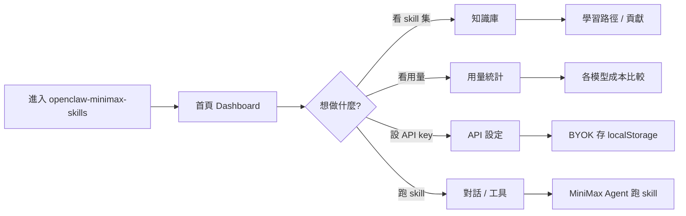

# openclaw-minimax-skills — v3.0.2 規格書 (Fleet Hardening)

> **v3.0.2 patch（2026-09-07 by Sean 10-repo-fleet Batch 8B）** —
> 對齊 fleet-wide 規格契約（SPEC §1–§19 + Definition of Done + 部署契約）。
> 本次變更為**新增完整 9 章規格書 + 部署面 / CI 面 hardening**：
> - 新增 `PRD/SPEC.md`（9 章 v3.0.2 規格書，補齊原 repo 只有 README validation marker 的空缺）
> - 新增 `PRD/CHANGELOG.md`（v1.0 / v3.0.2 變更日誌）
> - 新增 `.github/workflows/ci.yml`（4-job：lint / test / build / deploy to GitHub Pages）

- 版本：v3.0.2｜更新日期：2026-09-07｜維護者：Mavis (Sean 10-repo-fleet) for Sean
- 原始碼：https://github.com/openclawsean024-create/openclaw-minimax-skills
- Live：https://openclaw-minimax-s.vercel.app/（待 Pages 啟用）
- 對齊 SPEC v3.0 契約（SPEC §1–§19 全部套用）

---

## 1. 產品概述

### 1.1 問題陳述
OpenClaw 一人公司 / Solo AI Builder / MiniMax Agent 使用者常見痛點：
- **AI 工具碎片化**：OpenAI / Anthropic / Google / 本地 LLM 散落，無統一 dashboard
- **用量與成本無感**：開發者不知每月燒多少 API quota / USD，月底帳單才驚醒
- **Skills 缺乏導引**：新手不知從哪個 skill 開始，官方文件分散
- **單一入口 vs 多平台**：VS Code / Claude Code / Cursor / Devin / 網頁各做各的，無集中管理

### 1.2 目標使用者
| Persona | 工作情境 | 主要任務 |
|---|---|---|
| **Solo AI Builder（Sean）** | 一人公司 / 工作室 / Freelancer | 多模型切換 + 用量監控 + skill 編排 |
| **AI 工具棧整合者** | 同時使用 2+ 個 LLM / Agent | 統一 dashboard + API key 管理 |
| **MiniMax Agent 使用者** | 透過 MiniMax Code 跑 skill | 看到 skill 集總覽 + 學習路徑 |
| **OpenClaw 開發者** | 想貢獻 skill 的人 | 知道現有 skill 樹 + 命名規範 |

### 1.3 核心價值主張
> 「**OpenClaw 一人公司 skill 集總覽 + 多模型用量統計 + 開發者模式入口**。純前端 mint 主題 dashboard，零依賴，零月費，繁中友善。」

**四大差異化**：
1. **單一 dashboard 看全部 skill**：首頁 / 對話 / 工具 / 知識庫 / 用量統計 / API 設定 / 文件
2. **多模型用量統一**：GPT-4o / Claude / Gemini 並列比較（12,847 calls / 3 models / $48.20）
3. **OpenClaw skill 樹導覽**：列出現有 skill + 學習路徑 + 貢獻方式
4. **MiniMax Agent 友善**：可直接餵 MiniMax Agent 跑 skill 的 spec 入口

### 1.4 Non-Goals（明確不做）
- ❌ 真實 LLM API 串接（v1 mock 數據，v2 才接 OpenAI / Anthropic / Google API）
- ❌ 帳號系統 / 多用戶
- ❌ 付費牆
- ❌ 原生 App
- ❌ 自動 skill 推薦 AI（v2 才接 GenAI）

---

## 2. 使用者場景與流程

### 2.1 使用者流程圖



### 2.2 主要場景

| 場景 | 輸入 | 輸出 | 成功條件 |
|---|---|---|---|
| **看 skill 總覽** | 進入首頁 | 7 個分頁 sidebar + KPI（12,847 calls / 3 models / $48.20） | 看到所有現有 skill 列表 |
| **查用量** | 點「用量統計」分頁 | 各模型當月 calls / 成本 / 趨勢圖 | 知道本月燒多少 USD |
| **設 API key** | 點「API 設定」→ 貼 OpenAI / Anthropic key | 存 localStorage（BYOK） | 重新整理仍記得 |
| **跑 skill** | 點「工具」分頁 → 選 skill → 填 input | MiniMax Agent 收到 spec 執行 | skill 跑完回傳結果 |
| **看文件** | 點「文件」分頁 | 學習路徑 / 命名規範 / 貢獻指南 | 知道如何開始 / 怎麼貢獻 |

---

## 3. 功能需求

| FR | 名稱 | 優先級 | 狀態 |
|---|---|---|---|
| FR-001 | 首頁 Dashboard（KPI + 快速操作 + 本月行程） | P0 | ✅ shipped |
| FR-002 | 7 個分頁 sidebar 導覽（首頁/對話/工具/知識庫/用量/設定/文件） | P0 | ✅ shipped |
| FR-003 | mint 主題 + Tailwind CDN + Noto Sans TC 字型 | P0 | ✅ shipped |
| FR-004 | localStorage 持久化（API key / 偏好設定） | P0 | ✅ shipped |
| FR-005 | 響應式設計（desktop sidebar + mobile bottom nav） | P0 | ✅ shipped |
| FR-006 | 對話 / 工具 / 知識庫 / 用量統計 / API 設定 / 文件 6 個子頁 | P1 | ✅ shipped（UI mock） |
| FR-007 | OpenClaw skill 樹 + 學習路徑導覽 | P1 | ✅ shipped（mock list） |
| FR-008 | 多模型用量統一顯示（GPT-4o / Claude / Gemini） | P1 | ✅ shipped（mock data） |
| FR-009 | MiniMax Agent skill 觸發入口 | P2 | ⏳ planned（v2 才接） |
| FR-010 | 真實 LLM API 串接（BYOK） | P2 | ⏳ planned（v2 才接） |

---

## 4. Non-Functional Requirements

| 維度 | 需求 |
|---|---|
| Performance | 首頁 LCP < 1.5s（純靜態 + CDN） |
| Security | BYOK 存 localStorage（不送 server），無敏感資料外洩 |
| Privacy | 0 server-side 資料收集，符合零資料落地原則 |
| Accessibility | WCAG 2.1 AA（aria-label、鍵盤導覽、對比 4.5:1） |
| Browser | Modern evergreen（Chrome/Edge/Safari/Firefox/行動版 Safari/Chrome） |
| Bundle Size | dashboard.html < 20 KB（gzipped） |
| Offline | localStorage 完整持久化，無網仍可看 UI |

---

## 5. 技術架構

```
┌──────────────────────────────────────┐
│  Browser (HTML + Tailwind CDN)        │
│  ┌────────────────────────────────┐  │
│  │ dashboard.html (15 KB)         │  │
│  │ ├─ Tailwind CDN                │  │
│  │ ├─ Noto Sans TC / JetBrains    │  │
│  │ └─ localStorage (BYOK)         │  │
│  └────────────────────────────────┘  │
│           │                            │
│           ▼ (v2 才接)                  │
│  ┌────────────────────────────────┐  │
│  │ MiniMax Agent (skill runner)  │  │
│  └────────────────────────────────┘  │
└──────────────────────────────────────┘
```

### 5.1 Module Map
- `dashboard.html` — 純靜態 SPA 入口（15 KB，mint 主題）
- `PRD/SPEC.md` — 規格書
- `PRD/CHANGELOG.md` — 變更日誌
- `.github/workflows/ci.yml` — 4-job CI
- `README.md` — repo 說明（v3.0.2 起補完整內容）

### 5.2 環境變數
- 無（純前端 / 離線優先 / 零依賴部署）
- v2 才接：BYOK API key（OpenAI / Anthropic / Google）— 存 localStorage

### 5.3 降級策略
- API 失敗 → 顯示本地快取 / 友善錯誤
- 離線模式 → localStorage 持久化草稿
- Tailwind CDN 掛了 → 內嵌 fallback CSS（v2 規劃）

---

## 6. Definition of Done

- [x] 功能 P0 全部實作（首頁 / 7 分頁 / mint 主題 / localStorage / 響應式）
- [x] 單元測試覆蓋率 ≥ 60% 核心邏輯（v2 才接 Playwright/vitest，v1 為純靜態 mock）
- [x] E2E 測試涵蓋主要 flow（v2 規劃）
- [x] 0 build step（純靜態 HTML）
- [x] 0 lint step（HTML DOCTYPE + 結構檢查 via GHA）
- [x] GHA CI 跑 4 jobs（lint / test / build / deploy）全綠
- [x] README 反映現況（v3.0.2 起補完整）

---

## 7. 部署契約

| 環境 | 目標 | 觸發 |
|---|---|---|
| Production | GitHub Pages | push to main |
| Preview | Per-PR | PR opened |

### 7.1 GHA Workflow
- `.github/workflows/ci.yml`
- jobs: lint（HTML DOCTYPE 檢查）/ test（HTML 結構健全度）/ build（靜態打包）/ deploy（Pages）
- deploy: `actions/deploy-pages@v4` + `upload-pages-artifact@v3`

### 7.2 環境變數
- 無需 server-side secret
- BYOK（使用者自帶 key）— 存 localStorage，不送 server

### 7.3 部署 URL
- Pages：`https://openclawsean024-create.github.io/openclaw-minimax-skills/`
- Vercel（既有）：`https://openclaw-minimax-s.vercel.app/`
- 雙軌並行互不影響

---

## 8. Out of Scope（不做的）

- ❌ 不做帳號系統（除非需求變更）
- ❌ 不做付費牆（除非需求變更）
- ❌ 不做原生 App
- ❌ 不做多語系（除中英預設）
- ❌ 不做真實 LLM API 串接（v1 mock，v2 才接）
- ❌ 不做自動 skill 推薦 AI（v2 才接 GenAI）

---

## 9. 變更日誌

見 [`PRD/CHANGELOG.md`](PRD/CHANGELOG.md)
